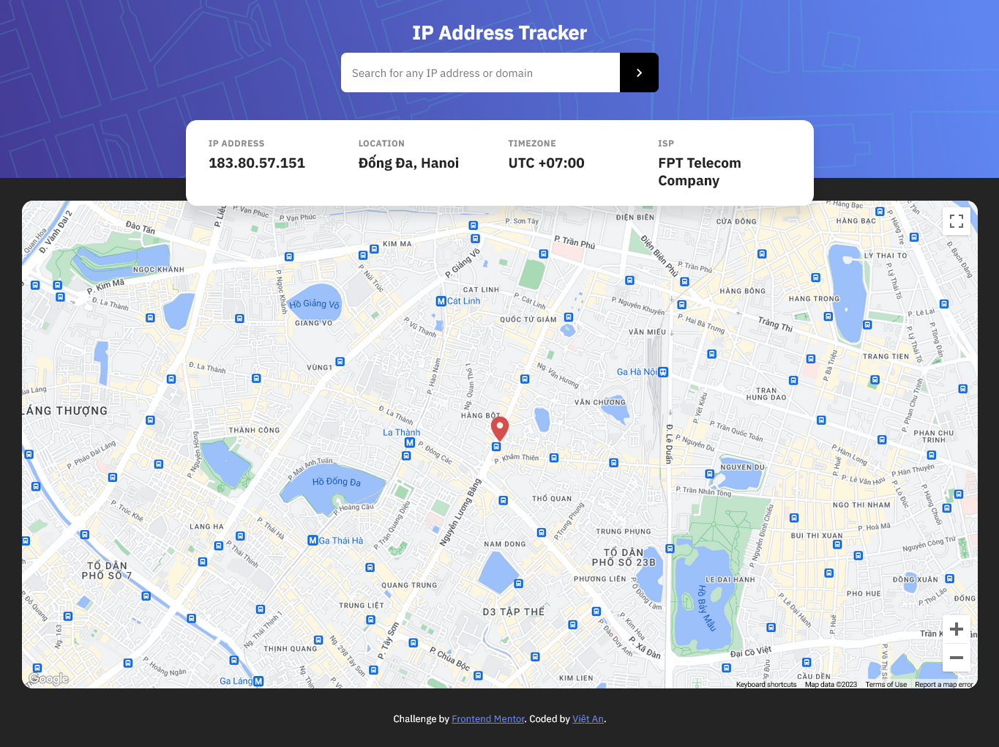

# Frontend Mentor - IP address tracker solution

This is a solution to the [IP address tracker challenge on Frontend Mentor](https://www.frontendmentor.io/challenges/ip-address-tracker-I8-0yYAH0). Frontend Mentor challenges help you improve your coding skills by building realistic projects. 

## Table of contents

- [Overview](#overview)
  - [The challenge](#the-challenge)
  - [Screenshot](#screenshot)
  - [Links](#links)
- [My process](#my-process)
  - [Built with](#built-with)
- [Author](#author)

## Overview

### The challenge

Users should be able to:

- View the optimal layout for each page depending on their device's screen size
- See hover states for all interactive elements on the page
- See their own IP address on the map on the initial page load
- Search for any IP addresses or domains and see the key information and location

### Screenshot

### Links

- [Solution Page on Frontend Mentor](https://www.frontendmentor.io/solutions/ip-address-tracker-using-react-and-google-maps-Z9QqnaiRRB)
- [Live Website](https://fm-ip-address-tracker-vietan0.netlify.app/)

## My process

### Built with

- [React](https://reactjs.org/)
- [google-map-react](https://github.com/google-map-react/google-map-react)
- Semantic HTML5 markup
- CSS custom properties
- Flexbox
- CSS Grid

## Author

- Frontend Mentor - [@vietan0](https://www.frontendmentor.io/profile/vietan0)
- Linkedin - [@vietan](https://www.linkedin.com/in/vietan/)
